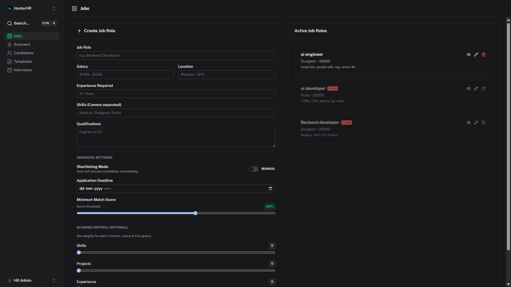
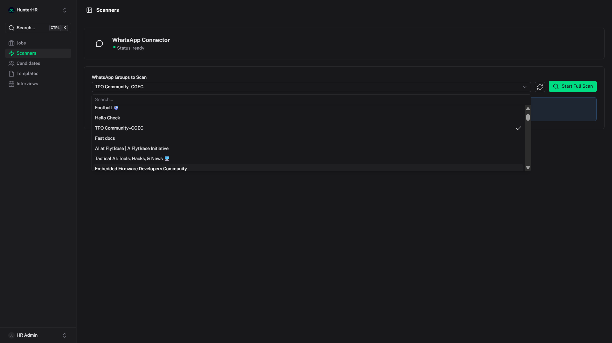
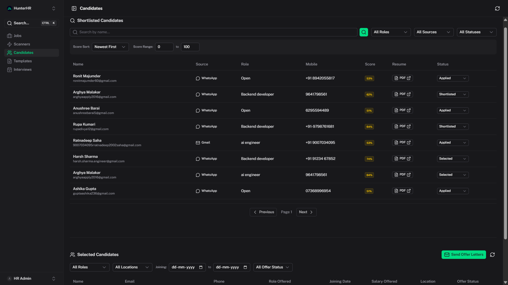
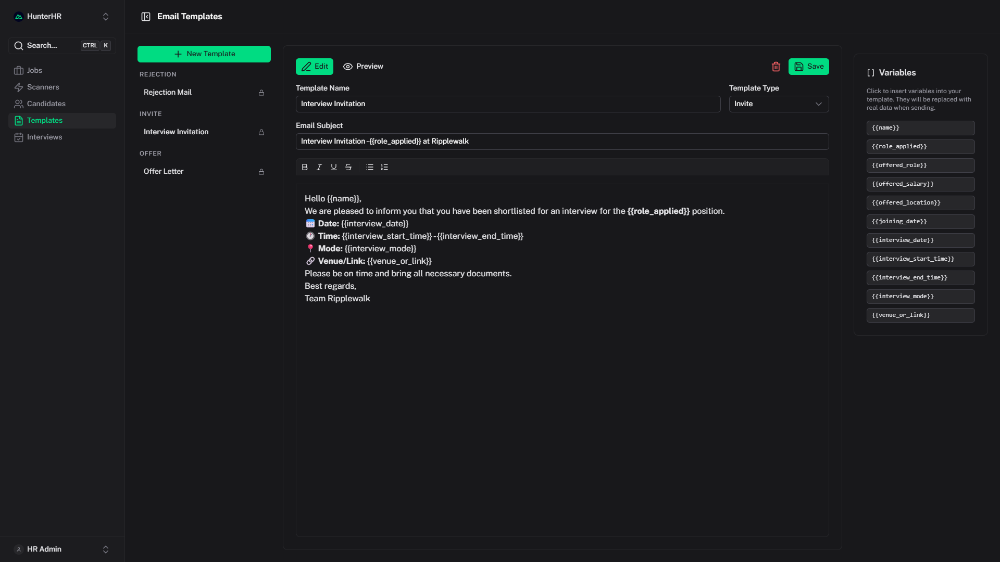
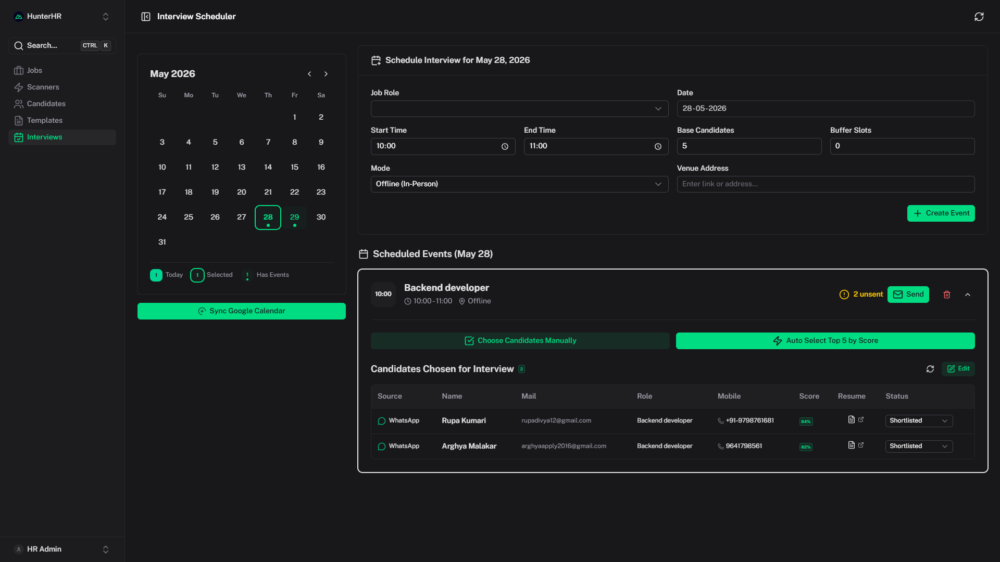

# HR Recruitment Dashboard

> An AI-powered, end-to-end recruitment automation platform built with **Nuxt 4**, **PostgreSQL**, **Ollama (LLaMA 3)**, **Qdrant vector search**, and **Google Workspace APIs**. It automates every stage of hiring — from posting job descriptions to scanning resumes, shortlisting candidates, scheduling interviews, and dispatching offer/rejection emails.

[](https://ui.nuxt.com)
[](./LICENSE)
[](./docker-compose.yml)

---

## ⚠️ License Notice

This project is built on top of the **[Nuxt UI Dashboard Template](https://github.com/nuxt-ui-templates/dashboard)**, originally created by [Nuxt UI Templates](https://github.com/nuxt-ui-templates) and licensed under the **MIT License**.

> The original template's copyright notice and license are preserved as required by the MIT License terms. See [`LICENSE`](./LICENSE) and [`README.nuxt-template.md`](./README.nuxt-template.md) for the original template documentation.

All application-specific code (server APIs, AI pipeline, database schema, UI pages) built on top of this template is developed independently for recruitment automation purposes.

---

## Table of Contents

- [Overview](#overview)
- [Use Case Walkthrough](#use-case-walkthrough)
- [Screenshots](#screenshots)
- [Tech Stack](#tech-stack)
- [Low-Level System Design & Flow](#low-level-system-design--flow)
- [Prerequisites](#prerequisites)
- [Environment Variables](#environment-variables)
- [Running the Project](#running-the-project)
- [Development (Without Docker)](#development-without-docker)
- [Project Structure](#project-structure)

---

## Overview

The HR Recruitment Dashboard is a self-hosted, AI-augmented hiring platform that replaces manual HR workflows. It connects to your Gmail inbox, scans attachments, uses a local LLM (via Ollama) and vector embeddings (via Qdrant) to parse and score resumes, and automates the full candidate lifecycle — shortlisting, interview scheduling, and email communications.

---

## Use Case Walkthrough

### Step 1 — HR Creates a Job Description (JD)

The HR manager logs in and navigates to the **Jobs** page.

- Fills in the role title, salary band, required skills, qualification, experience, and location.
- Optionally configures **shortlisting criteria weights** (e.g., skills: 0.5, experience: 0.3, projects: 0.2) for fine-grained AI scoring.
- Sets a **minimum score threshold** and **shortlisting mode** (`manual` or `auto`).
- On save, the JD is stored in PostgreSQL and its vector embedding is upserted into **Qdrant** for semantic resume matching.

---

### Step 2 — Scan WhatsApp & Gmail for Applications

The HR navigates to the **Scanners** page and triggers scans:

- **Gmail Scan**: Fetches emails with PDF attachments from the connected Google account. Each PDF is parsed as a resume, analyzed by the local LLM (Ollama) to confirm it is a job application, then scored and matched to an active JD using vector similarity.
- **WhatsApp Scan**: Connects via `whatsapp-web.js` (Puppeteer-based) to scan incoming WhatsApp messages for resume attachments, processed through the same AI pipeline.
- Candidate data (name, email, phone, role matched, score, source) is saved to the database and deduplicated.
- Resumes are uploaded to **ImageKit** for persistent CDN storage.

---

### Step 3 — Review Candidates in the Table

The HR navigates to the **Candidates** page:

- A full data table lists all candidates with their name, applied role, AI match score, source (Gmail / WhatsApp), experience level, and current status.
- Candidates can be filtered by role, score range, or source.
- HR can manually review candidate profiles and update status (`shortlisted`, `rejected`, `selected`).
- In **auto mode**, candidates above the configured minimum score are automatically shortlisted.

---

### Step 4 — Schedule an Interview Event

The HR navigates to the **Interviews** page and creates a new interview event:

- Specifies the role, date, time slot (start/end), mode (`online` / `offline`), venue or meeting link, and number of candidate slots.
- The event is saved to PostgreSQL and synced to **Google Calendar** via the Calendar API.

---

### Step 5 — Assign Candidates to Interview Slots

Once an event is created:

- HR can **manually** select candidates from the shortlisted pool and assign them to the event.
- Alternatively, using **Auto-Assign**, the system automatically picks the top-scoring eligible candidates for a role and assigns them to the event's available slots.
- Assigned candidates are tracked in the `interview_candidates` join table.

---

### Step 6 — Select / Reject Candidates

After interviews:

- HR updates each candidate's status to `selected` or `rejected` directly from the Candidates or Interviews page.
- Selected candidates can have their offer details filled in (offered role, salary, location, joining date).

---

### Step 7 — Trigger Emails (Offer / Rejection / Interview Invites)

The HR navigates to the **Email Templates** page to manage template content using a rich text editor with Handlebars variable support (e.g., `{{name}}`, `{{role_applied}}`, `{{interview_date}}`).

Three primary email actions:

| Action | Trigger | Template Variables |
|---|---|---|
| **Interview Invite** | From interview event screen | `{{name}}`, `{{role_applied}}`, `{{interview_date}}`, `{{interview_start_time}}`, `{{interview_end_time}}`, `{{interview_mode}}`, `{{venue_or_link}}` |
| **Offer Letter** | From selected candidates | `{{name}}`, `{{offered_role}}`, `{{offered_salary}}`, `{{offered_location}}`, `{{joining_date}}` |
| **Rejection Mail** | From rejected candidates | `{{name}}`, `{{role_applied}}` |

- Emails are sent via the **Gmail API** (using the HR's connected Google account) — no third-party SMTP needed.
- Sent status is tracked per candidate (`invite_sent`, `offer_sent`) to prevent duplicate sending.

---

## Screenshots

### Jobs Page — Job Description Management



---

### Scanners Page — WhatsApp Connection & Group Selection



---

### Candidates Table — Shortlisted Candidates



---

### Email Templates Editor



---

### Interviews Page — Event Scheduler & Slot Assignment



---

## Tech Stack

### Frontend
| Technology | Purpose |
|---|---|
| **Nuxt 4** | Full-stack Vue framework (SSR + server routes) |
| **Nuxt UI v4** | Component library (tables, modals, forms, toasts) |
| **Vue 3** | Reactive UI |
| **TailwindCSS v4** | Utility-first styling |
| **Tiptap v2** | Rich text editor for email templates |
| **Unovis** | Charts and data visualizations on the dashboard |
| **VueUse** | Composable utilities |
| **date-fns** | Date formatting and manipulation |

### Backend (Nuxt Server Routes)
| Technology | Purpose |
|---|---|
| **Nuxt Server API** | File-based API routes (`server/api/`) |
| **PostgreSQL 15** | Primary relational database |
| **node-postgres (`pg`)** | PostgreSQL client |
| **Redis** | Session/cache layer |
| **Google APIs (`googleapis`)** | Gmail + Google Calendar integration |
| **Handlebars** | Email template variable compilation |
| **jsonwebtoken** | JWT-based session auth |
| **pdf-parse** | Resume PDF text extraction |
| **whatsapp-web.js** | WhatsApp scanning via Puppeteer |
| **ImageKit** | Resume CDN storage |

### AI & Vector Search
| Technology | Purpose |
|---|---|
| **Ollama (LLaMA 3 / phi3)** | Local LLM for resume analysis and email classification |
| **Qdrant** | Vector database for semantic JD ↔ resume matching |
| **BAAI/bge-small-en-v1.5** | Embedding model (via `@xenova/transformers`) |

### Infrastructure
| Technology | Purpose |
|---|---|
| **Docker + Docker Compose** | Container orchestration |
| **Puppeteer / Chromium** | Headless browser for WhatsApp Web |

---

## Low-Level System Design & Flow

### Architecture Overview

```
┌──────────────────────────────────────────────────────────────────┐
│                         Browser (Nuxt UI)                        │
│  Jobs │ Candidates │ Interviews │ Scanners │ Templates           │
└──────────────────────┬───────────────────────────────────────────┘
                       │ HTTP (fetch / useFetch)
┌──────────────────────▼───────────────────────────────────────────┐
│                    Nuxt 4 Server (H3)                            │
│  server/api/                                                     │
│  ├── auth/          (Google OAuth, JWT session)                  │
│  ├── jobs/          (CRUD + Qdrant vector upsert)                │
│  ├── candidates/    (CRUD, status patch, scan triggers)          │
│  ├── mail/          (Gmail scan, WhatsApp scan)                  │
│  ├── interviews/    (events, slot assignment, calendar sync)     │
│  └── templates/     (email template CRUD)                        │
│                                                                  │
│  server/utils/                                                   │
│  ├── db.ts          (PostgreSQL pool, schema init)               │
│  ├── ai.ts          (Ollama: resume match, email classify)       │
│  ├── vectorMatch.ts (Qdrant: embed + cosine similarity)          │
│  ├── resumeParser.ts(PDF parse + section extraction)             │
│  ├── gmail.ts       (Gmail API: fetch, attachment download)      │
│  ├── mailer.ts      (Gmail API: send offer/invite/rejection)     │
│  ├── calendar.ts    (Google Calendar: event sync)                │
│  ├── whatsapp.ts    (whatsapp-web.js: QR auth + scan)           │
│  └── imagekit.ts    (CDN: resume upload)                         │
└───────────────┬──────────────────────────────────────────────────┘
                │
    ┌───────────┼──────────────────────────────────┐
    │           │                                  │
    ▼           ▼                                  ▼
PostgreSQL    Qdrant                           Ollama
(candidates,  (job_descriptions                (llama3 / phi3:
 job_roles,    collection —                    resume parse,
 events,       multi-vector:                   email analysis)
 templates)    full, skills,
               experience)
```

---

### Resume Ingestion Pipeline (Gmail / WhatsApp)

```
Trigger Scan (HR clicks "Scan Gmail" or "Scan WhatsApp")
        │
        ▼
Fetch emails/messages with PDF attachments
(Gmail API: has:attachment after:<last_scan_timestamp>)
        │
        ▼
For each email → is it a job application?
  → Ollama (analyzeEmail): returns { isApplication, position }
        │
        ├── No → Skip
        │
        └── Yes
              │
              ▼
        Download PDF attachment
              │
              ▼
        pdf-parse → extract raw resume text
              │
              ▼
        resumeParser → extract sections
        (skills, experience, projects)
              │
              ▼
        Parallel:
        ┌─────────────────────────────────────────┐
        │                                         │
        ▼                                         ▼
  Ollama (matchResume)               vectorMatch.matchResumeToJobs
  → name, email, phone,              → embed resume with
    experience, CTC, location           BAAI/bge-small-en-v1.5
                                     → search Qdrant top-3 JDs
                                     → weighted cosine similarity
                                     → { target_role, score }
        │                                         │
        └──────────────┬──────────────────────────┘
                       ▼
        Merge: candidate profile + role + score
                       │
                       ▼
        Upload resume PDF → ImageKit CDN
                       │
                       ▼
        INSERT INTO candidates (PostgreSQL)
        (deduplicated by email)
                       │
                       ▼
        If auto-shortlist mode + score ≥ min_score
        → status = 'shortlisted' automatically
```

---

### Interview Scheduling Flow

```
HR creates Interview Event
  → POST /api/interviews/events
  → INSERT INTO interview_events (PostgreSQL)
  → POST /api/interviews/sync-calendar
  → Google Calendar API: create event
        │
        ▼
HR assigns candidates (manual or auto)
  Manual: PATCH /api/interviews/events/{id}/candidates/manual
  Auto:   POST  /api/interviews/events/{id}/candidates/auto
          → SELECT top N candidates by score WHERE role = event.role
          → INSERT INTO interview_candidates
        │
        ▼
HR sends invites
  → POST /api/mail/send-invites
  → For each candidate WHERE invite_sent = false:
      - Compile Handlebars template with event + candidate data
      - Gmail API: send HTML email
      - UPDATE interview_candidates SET invite_sent = true
```

---

### Email Dispatch Flow

```
HR triggers email action:
  ┌───────────────┬──────────────────┬───────────────┐
  │  Interview    │   Offer Letter   │  Rejection    │
  │  Invite       │                  │  Mail         │
  └──────┬────────┴─────────┬────────┴──────┬────────┘
         │                  │               │
         ▼                  ▼               ▼
  Fetch template from PostgreSQL (email_templates)
         │
         ▼
  Compile Handlebars template with candidate/event variables
         │
         ▼
  Build RFC 2822 raw email (base64url encoded)
         │
         ▼
  Gmail API: users.messages.send (OAuth2 token)
         │
         ▼
  UPDATE candidates/interview_candidates
  SET offer_sent/invite_sent = true
```

---

### Database Schema (PostgreSQL)

```sql
job_roles           — JD definitions + scoring config + criteria weights
candidates          — Candidate profiles, scores, status, offer details
scan_timestamps     — Tracks last Gmail / WhatsApp scan time
interview_events    — Interview slots (role, date, time, mode, venue)
interview_candidates— Many-to-many: event ↔ candidate + invite_sent flag
email_templates     — Handlebars HTML templates (offer, invite, rejection)
```

---

## Prerequisites

- [Docker Desktop](https://www.docker.com/products/docker-desktop/) installed and running
- A **Google Cloud Project** with Gmail API and Google Calendar API enabled
- OAuth 2.0 credentials (Client ID + Secret) configured for your Google account
- (Optional) [ImageKit](https://imagekit.io/) account for resume CDN storage

---

## Environment Variables

Copy `.env.example` to `.env` and fill in your values:

```bash
cp .env.example .env
```

| Variable | Description |
|---|---|
| `DATABASE_URL` | PostgreSQL connection string |
| `GOOGLE_CLIENT_ID` | Google OAuth Client ID |
| `GOOGLE_CLIENT_SECRET` | Google OAuth Client Secret |
| `GOOGLE_REDIRECT_URI` | OAuth redirect URI (e.g. `http://localhost:3001/api/auth/google/callback`) |
| `JWT_SECRET` | Secret key for JWT session tokens |
| `FRONTEND_URL` | Your app's base URL |
| `OLLAMA_BASE_URL` | Ollama API URL (default: `http://ollama:11434` inside Docker) |
| `OLLAMA_MODEL` | LLM model name (e.g. `llama3` or `phi3`) |
| `IMAGEKIT_PUBLIC_KEY` | ImageKit public key |
| `IMAGEKIT_PRIVATE_KEY` | ImageKit private key |
| `IMAGEKIT_URL_ENDPOINT` | ImageKit CDN endpoint |
| `QDRANT_URL` | Qdrant vector DB URL (default: `http://qdrant:6333` inside Docker) |
| `PUPPETEER_EXECUTABLE_PATH` | Path to Chromium binary (set automatically in Docker) |

---

## Running the Project

### 1. Clone the repository

```bash
git clone <your-repo-url>
cd dashboard
```

### 2. Configure environment

```bash
cp .env.example .env
# Edit .env with your Google OAuth credentials, JWT secret, etc.
```

### 3. Build and start all services

```bash
docker compose up --build
```

This starts:
- `hr-postgres` — PostgreSQL 15 on port `5432`
- `hr-redis` — Redis on port `6379`
- `hr-ollama` — Ollama LLM server on port `11434`
- `hr-qdrant` — Qdrant vector DB on port `6333`
- `nuxt-dashboard` — The Nuxt app on port `3001`

### 4. Pull the LLM model into Ollama

After the `hr-ollama` container is running, pull the model (only required once — data is persisted in a Docker volume):

```bash
# Recommended: LLaMA 3 (better accuracy)
docker exec -it hr-ollama ollama pull llama3

# Alternative: phi3 (faster / lower memory)
docker exec -it hr-ollama ollama pull phi3
```

> ⚠️ LLaMA 3 requires ~5 GB of disk space. Make sure Docker has sufficient resources allocated.

### 5. Open the app

Visit [http://localhost:3001](http://localhost:3001) and log in with your Google account.

---

### Useful Docker Commands

```bash
# Start in background (detached)
docker compose up -d --build

# View logs for the Nuxt app
docker compose logs -f dashboard

# View Ollama logs
docker compose logs -f ollama

# Stop all containers
docker compose down

# Stop and remove volumes (⚠️ deletes all data)
docker compose down -v

# Check running containers
docker ps

# Access PostgreSQL shell
docker exec -it hr-postgres psql -U postgres -d hr_onboarding

# List downloaded Ollama models
docker exec -it hr-ollama ollama list

# Remove and re-pull a model
docker exec -it hr-ollama ollama rm llama3
docker exec -it hr-ollama ollama pull llama3
```

---

## Development (Without Docker)

If you want to run the Nuxt app in dev mode while keeping the infrastructure services in Docker:

```bash
# Start only infrastructure services
docker compose up postgres redis ollama qdrant -d

# Pull a model if not already done
docker exec -it hr-ollama ollama pull llama3

# Install dependencies
pnpm install

# Start dev server (hot-reload)
pnpm dev
```

App runs on [http://localhost:3000](http://localhost:3000).

Other development commands:

```bash
# Type check
pnpm typecheck

# Lint
pnpm lint

# Build for production
pnpm build

# Preview production build locally
pnpm preview
```

---

## Project Structure

```
dashboard/
├── app/
│   ├── pages/
│   │   ├── index.vue           # Dashboard / overview
│   │   ├── candidates.vue      # Candidates table + status management
│   │   ├── interviews.vue      # Interview scheduler + calendar
│   │   ├── scanners.vue        # Gmail & WhatsApp scan triggers
│   │   ├── templates.vue       # Email template editor
│   │   ├── customers.vue       # (Jobs / JD management)
│   │   └── login.vue           # Google OAuth login
│   ├── components/             # Reusable Vue components
│   ├── composables/            # useDashboard, useAuth, etc.
│   └── layouts/                # Default layout (sidebar + navbar)
│
├── server/
│   ├── api/
│   │   ├── auth/               # Google OAuth + JWT
│   │   ├── jobs/               # JD CRUD
│   │   ├── candidates/         # Candidate CRUD + status
│   │   ├── mail/               # Gmail scan + WhatsApp scan
│   │   ├── interviews/         # Events, slot assignment, calendar sync
│   │   └── templates/          # Email template CRUD
│   ├── utils/
│   │   ├── db.ts               # PostgreSQL pool + schema init
│   │   ├── ai.ts               # Ollama: resume match + email classify
│   │   ├── vectorMatch.ts      # Qdrant embedding + cosine similarity
│   │   ├── resumeParser.ts     # PDF text extraction + section parsing
│   │   ├── gmail.ts            # Gmail API: fetch emails + attachments
│   │   ├── mailer.ts           # Gmail API: send emails via OAuth
│   │   ├── calendar.ts         # Google Calendar API
│   │   ├── whatsapp.ts         # WhatsApp Web scanning (Puppeteer)
│   │   ├── calendarAgent.ts    # Calendar event management helpers
│   │   └── imagekit.ts         # ImageKit CDN upload
│   └── plugins/                # Server-side plugins (DB init on startup)
│
├── docker-compose.yml          # All services
├── Dockerfile                  # Multi-stage Nuxt build
├── .env.example                # Environment variable template
├── nuxt.config.ts              # Nuxt configuration
├── package.json
├── LICENSE                     # MIT License (Nuxt UI Templates)
└── README.nuxt-template.md     # Original Nuxt dashboard template README
```

---

## Acknowledgements

This project is built on the **[Nuxt UI Dashboard Template](https://github.com/nuxt-ui-templates/dashboard)** by [Nuxt UI Templates](https://github.com/nuxt-ui-templates), licensed under the [MIT License](./LICENSE). The template provides the foundational UI shell including the sidebar layout, navigation, command palette, dark mode support, and Nuxt UI components. Application-specific features (AI pipeline, Google integrations, database schema, recruitment workflows) are custom-built on top of this template.

---

*Made with ❤️ using [Nuxt UI](https://ui.nuxt.com)*
